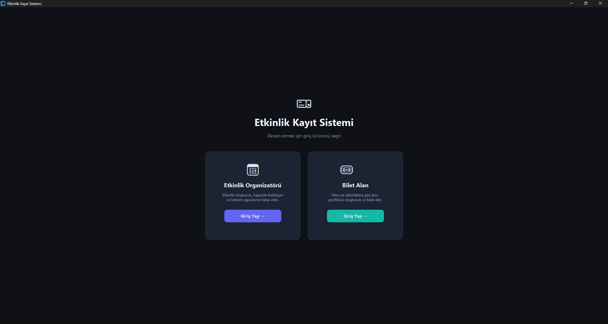

# 🎫 Etkinlik Kayıt Sistemi

Modern ve kullanıcı dostu bir arayüze sahip, Python ve CustomTkinter kullanılarak geliştirilmiş masaüstü Etkinlik Kayıt ve Yönetim uygulaması. 

Bu proje, Organizatörlerin yeni etkinlikler oluşturup yönetebildiği ve Katılımcıların bu etkinliklere bilet alabildiği çift rollü (dual-role) bir sistem sunmaktadır.

## ✨ Özellikler

Sistem iki temel kullanıcı rolü üzerinden çalışır:

### 📅 Organizatör Modu
* **Gelişmiş Panel:** Toplam etkinlik, kayıtlı kullanıcı ve satılan bilet istatistiklerini tek ekranda görüntüleme.
* **Etkinlik Yönetimi:** Tarih, mekân ve kapasite belirleyerek yeni etkinlikler oluşturma. Sistem otomatik benzersiz ID (örn. `E001`) atar.
* **Katılım Raporları:** Etkinliklerin doluluk oranlarını görsel barlarla takip etme, kalan boş yerleri ve kayıtlı katılımcı listelerini anlık olarak görme.

### 🎟️ Bilet Alan (Katılımcı) Modu
* **Etkinlik Keşfi:** Sistemdeki müsait etkinlikleri filtreleme, doluluk oranlarını ve durumlarını ("10 yer kaldı", "DOLU") listeleme.
* **Profil Yönetimi:** Kişisel profil oluşturma ve otomatik Katılımcı ID'si (örn. `K001`) alma.
* **Bilet Alma:** Seçilen etkinlik için anında e-bilet oluşturma (örn. `B001`).
* **Biletlerim:** Geçerli biletleri etkinlik detayları ve konum bilgileriyle birlikte listeleme.

## 📸 Ekran Görüntüleri

### Giriş Ekranı


### Organizatör Paneli


### Etkinlik Yönetimi (Oluşturma)


### Katılım Raporları


### Etkinlikleri Keşfet (Katılımcı)


### Profil Oluşturma ve Yönetimi


### Bilet Al Ekranı


### Biletlerim


## 🛠️ Kullanılan Teknolojiler

* **Python 3.x:** Ana programlama dili.
* **CustomTkinter:** Modern, karanlık/aydınlık tema destekli ve özelleştirilebilir arayüz tasarımı.
* **OOP (Nesne Yönelimli Programlama):** Sürdürülebilir ve modüler kod yapısı (`Katilimci`, `Etkinlik`, `Bilet`, `VeriDeposu` sınıfları).

## 🚀 Kurulum ve Çalıştırma

Projeyi yerel makinenizde çalıştırmak için aşağıdaki adımları izleyebilirsiniz:

1. Depoyu bilgisayarınıza klonlayın:
   ```bash
   git clone [https://github.com/kullaniciadin/etkinlik-kayit-sistemi.git](https://github.com/kullaniciadin/etkinlik-kayit-sistemi.git)
   cd etkinlik-kayit-sistemi

2. Gerekli bağımlılıkları yükleyin (requirements.txt dosyasını kullanarak):
Bash
pip install -r requirements.txt

3. Uygulamayı başlatın:
Bash
python main.py

📂 Proje Yapısı
main.py: Uygulamanın ana başlangıç noktası, arayüz bileşenleri ve sınıf tanımlamalarının bulunduğu dosya.
requirements.txt: Projenin çalışması için gereken kütüphanelerin listesi.

🤝 Katkıda Bulunma
Bu proje geliştirmeye açıktır. Pull request göndermekten veya hata bildirimleri için "Issue" açmaktan çekinmeyin!
